

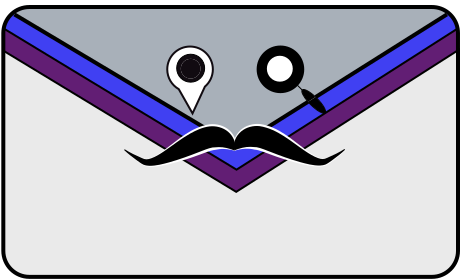

# DocTrack 

*A mobile-first document tracking system built for the modern age. 🚀*

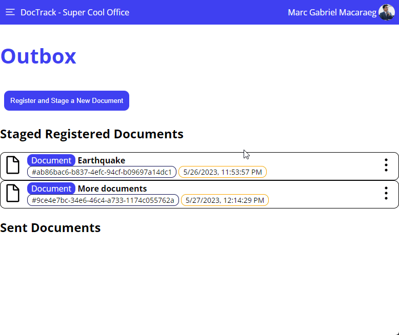

<a href="https://doctrack.deno.dev/">
    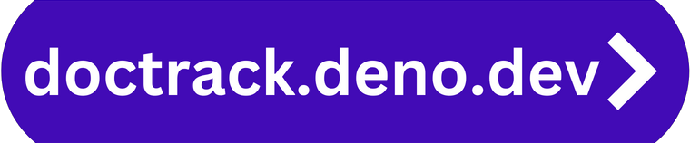
</a>

# Introduction

`DocTrack` is a robust, open-source document tracking system that utilizes modern web stacks to meet the demands of document management in the modern age. It offers a powerful and intuitive platform to efficiently manage and monitor documents within an organization or in any collaborative environment.

This is a course requirement for the CS 191/192 Software Engineering Courses of the [Department of Computer Science][dcs], [College of Engineering][coe], [University of the Philippines, Diliman][upd] under the guidance of [Ma. Rowena C. Solamo](https://dcs.upd.edu.ph/people/rowena-solamo/) for AY 2022-2023.

With a strong focus on modern web paradigms in development: `DocTrack` is a proof-of-concept on the usage of modern web frameworks such as [Svelte][svelte] and [Typescript][ts] in the front-end, [Deno][deno] and [Postgresql][pgsql] to handle the back-end, to create a single-page, Progressive Web Application that can handle offline use, deferred operations and resource caching.

The online version of `DocTrack` is hosted through [Deno Deploy][denodeploy] and is accessible [here][dtrack].

[dtrack]: https://doctrack.deno.dev/
[dcs]: https://dcs.upd.edu.ph/
[coe]: https://coe.upd.edu.ph/
[upd]: https://upd.edu.ph/
[svelte]: https://svelte.dev/
[ts]: https://www.typescriptlang.org/
[deno]: https://deno.com/
[denodeploy]: https://deno.com/deploy/
[pgsql]: https://www.postgresql.org/

<detail open>
    

        Highlights
    

     
    

        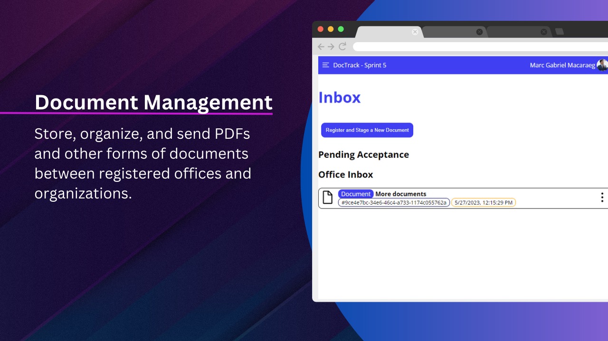 
        &nbsp;
        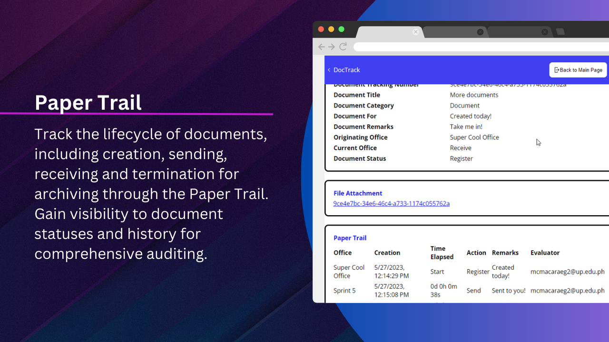 
    

    

        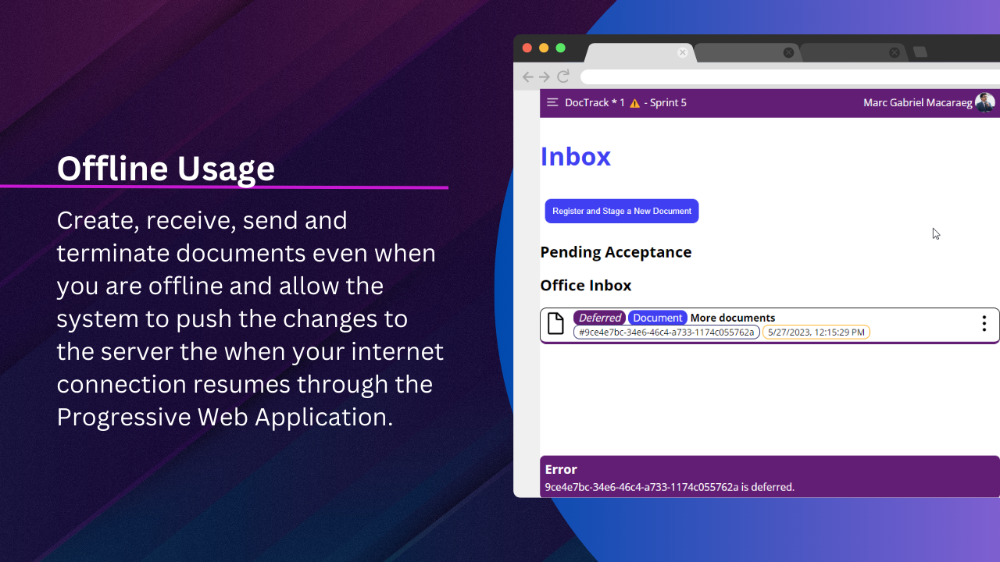 
        &nbsp;
        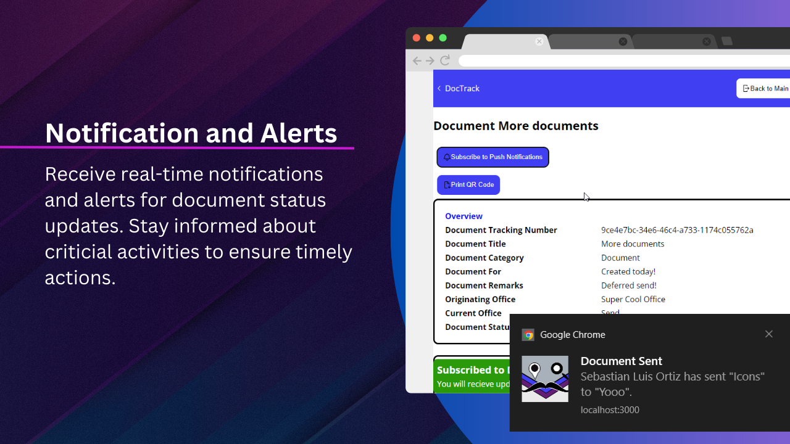 
    

    

        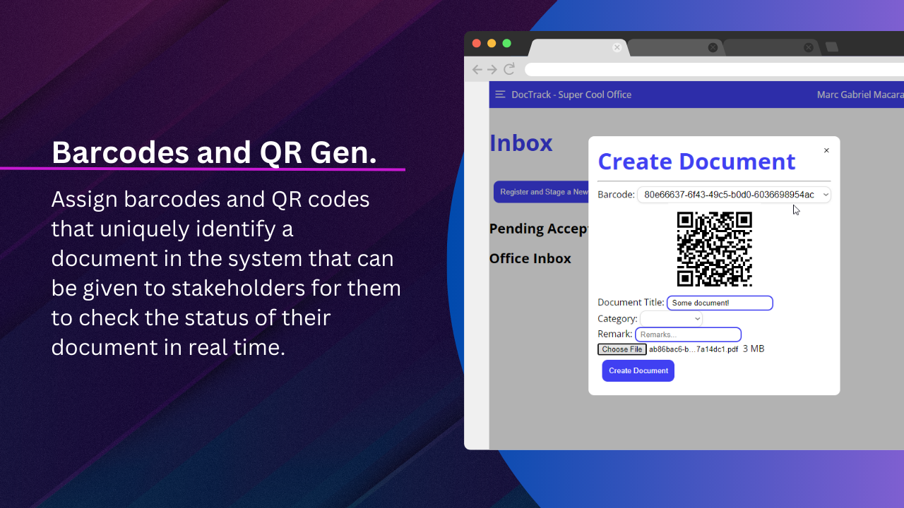 
        &nbsp;
        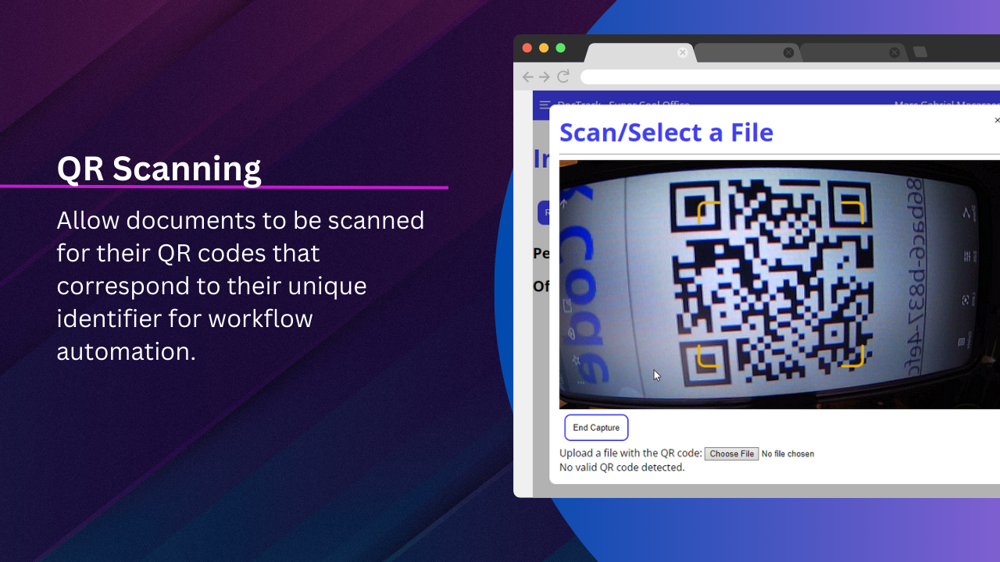 
    

    

        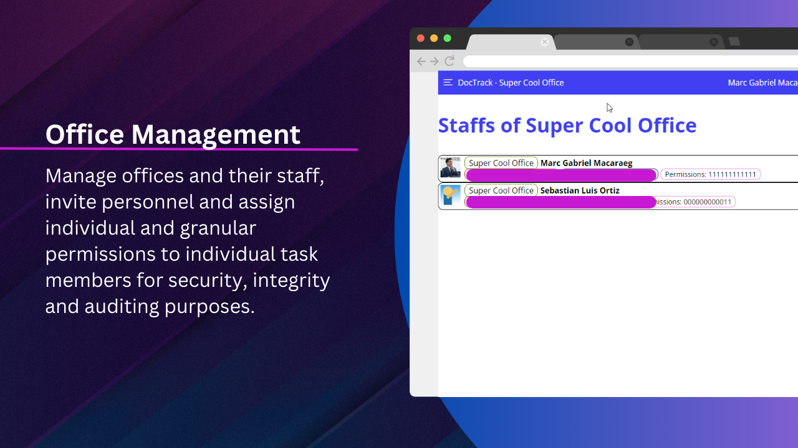 
        &nbsp;
        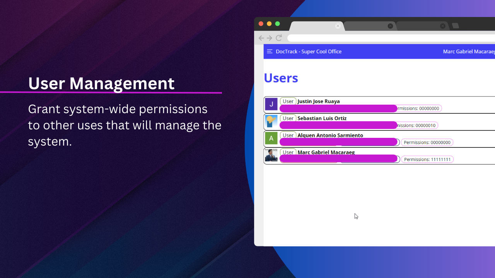 
    

    

        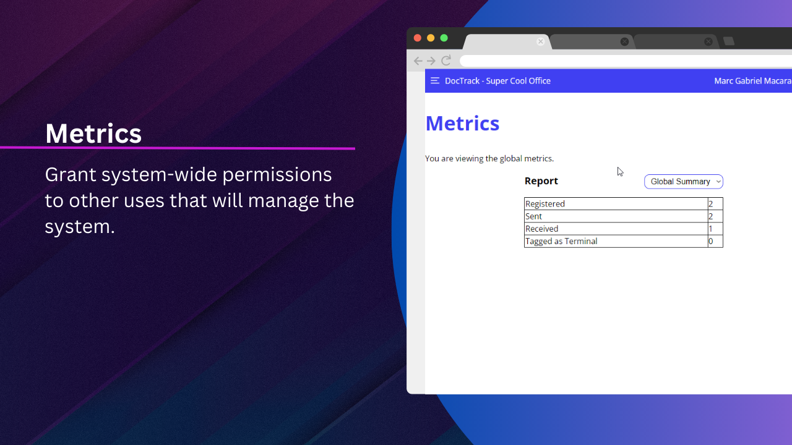 
        &nbsp;
        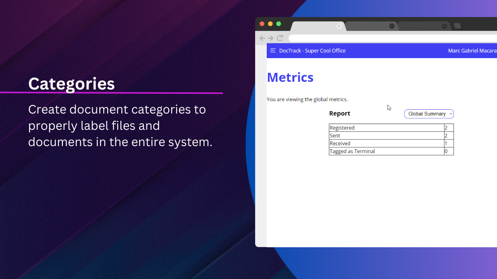 
    

</detail>

# Program Features

1. **📄Document Management** - Store, organize, and send PDFs and other forms of documents between registered offices and organizations.
2. **🔍Document Tracking** - Track the lifecycle of documents, including creation, sending, receiving and termination for archiving through the `Paper Trail`. Gain visibility to document statuses and history for comprehensive auditing.
3. **🔁Offline Usage** - Create, receive, send and terminate documents even when you are offline and allow the system to push the changes to the server the when your internet connection resumes through the Progressive Web Application.
4. **🔔Notification and Alerts** - Receive real-time notifications and alerts for document status updates. Stay informed about criticial activities to ensure timely actions.
5. **#️⃣Barcodes and QR Generation** - Assign barcodes and QR codes that uniquely identify a document in the system that can be given to stakeholders for them to check the status of their document in real time.
6. **📸QR Code Scanning** - Allow documents to be scanned for their QR codes that correspond to their unique identifier for workflow automation.
7. **💼Office Management** - Manage offices and their staff, invite personnel and assign individual and granular permissions to individual task members for security, integrity and auditing purposes.
8. **📶Metrics** - View metrics on individuals, offices and system wide operations to for auditing purposes.
9. **📁Categories** - Create document categories to properly label files and documents in the entire system.
10. **👨🏻‍💼User Management** - Grant system-wide permissions to other uses that will manage the system.

# Usage

To locally host `DocTrack`, see the respective `README.md` of the [Client][clientrme], [Model][modelrme], [Server][serverrme].

[clientrme]: ./client/README.md
[modelrme]: ./model/README.md
[serverrme]: ./server/README.md

# Project Members

* [Macaraeg, Marc Gabriel C.](https://github.com/SporadicToast)
* [Ortiz, Sebastian Luis S.](https://github.com/Some-Dood)
* [Ruaya, Justin Jose R.](https://github.com/justinruaya123)
* [Sarmiento, Alquen Antonio D.](https://github.com/Arukuen)